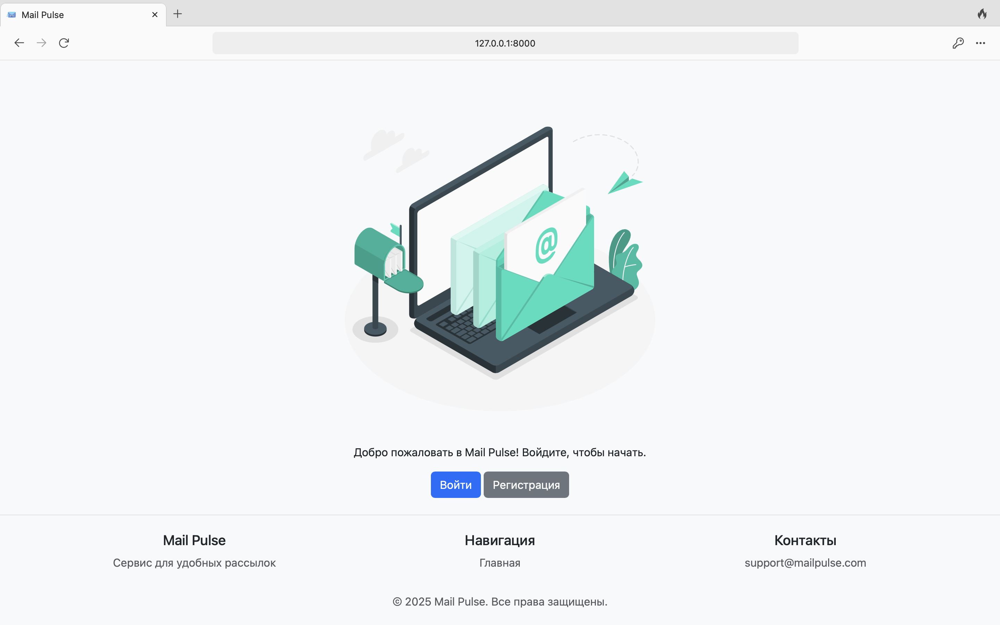
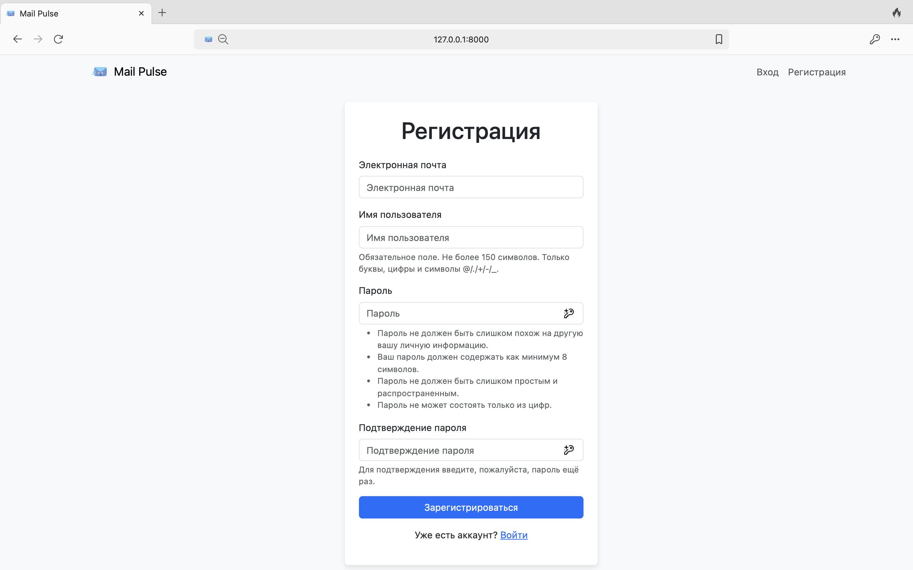
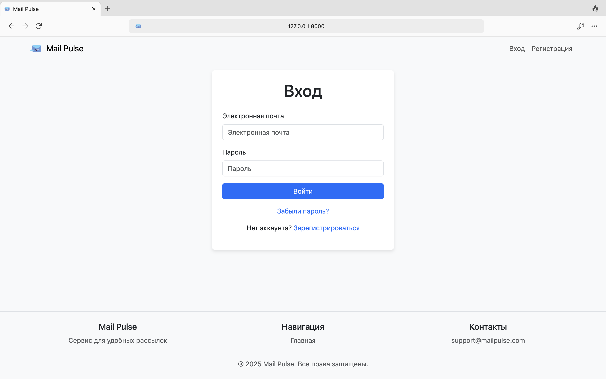
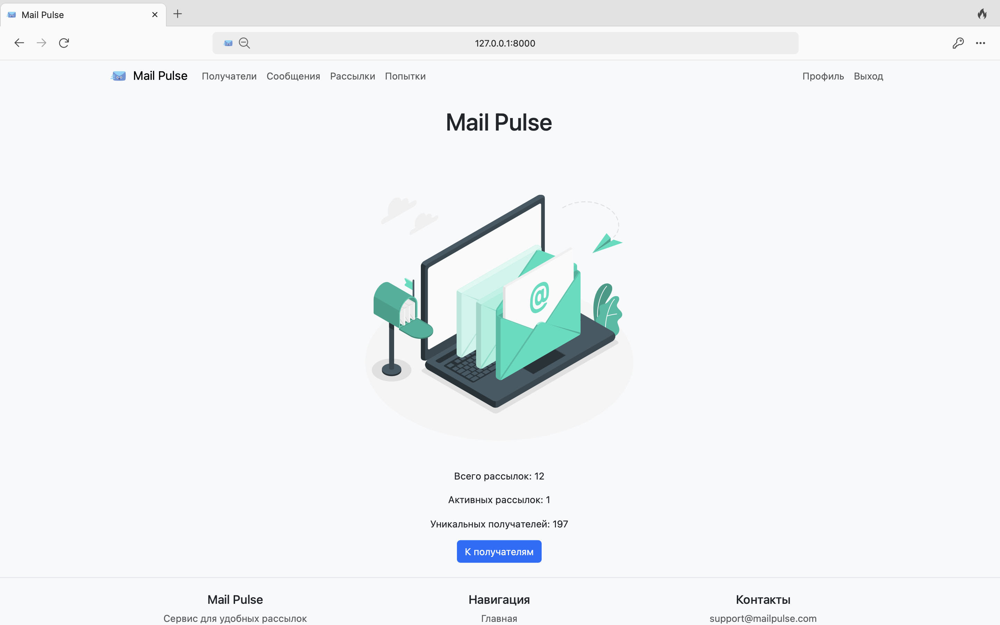
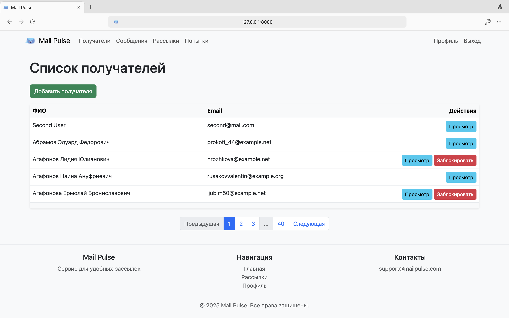
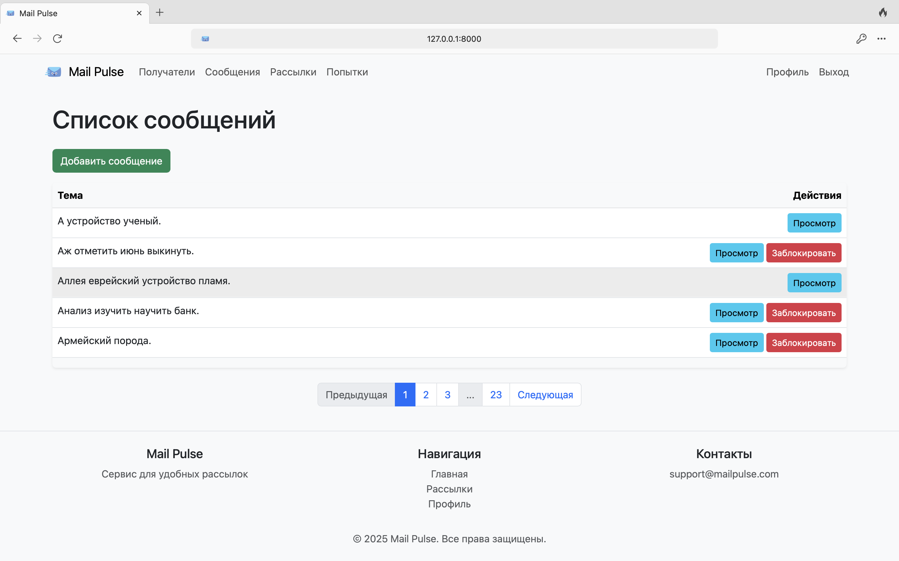
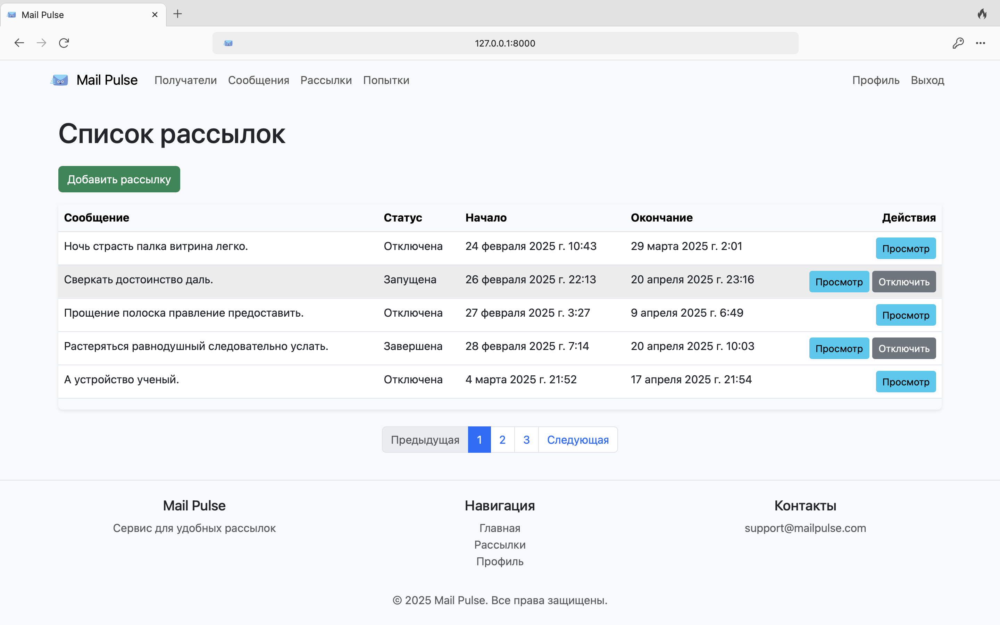
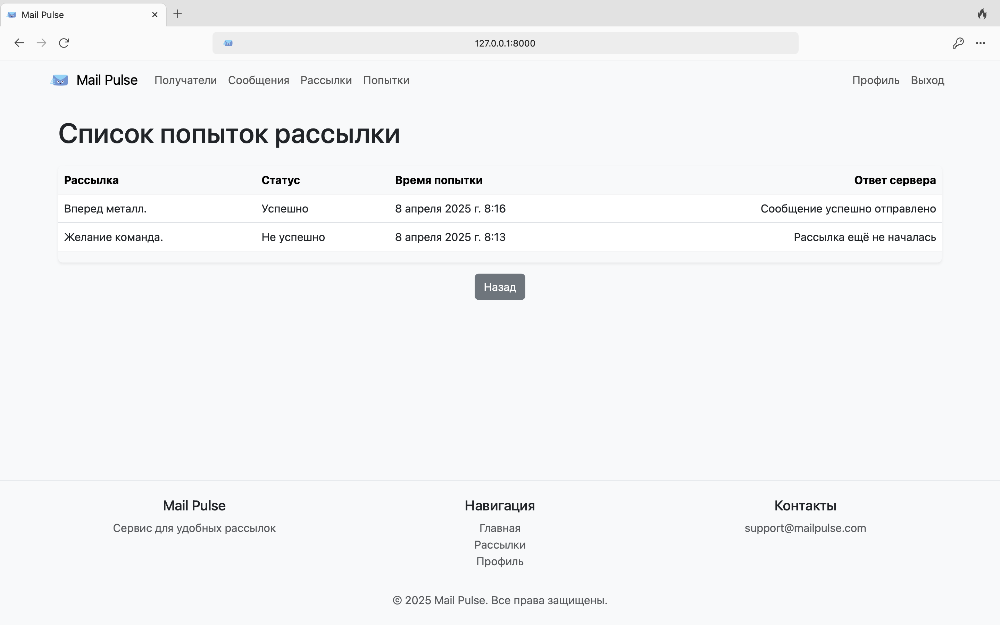
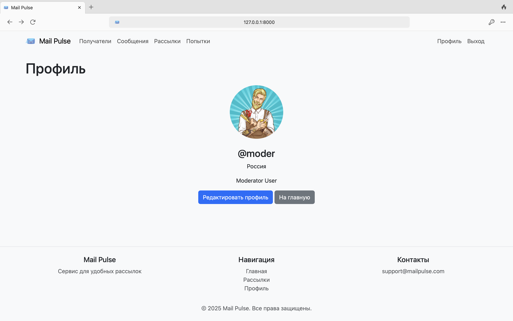
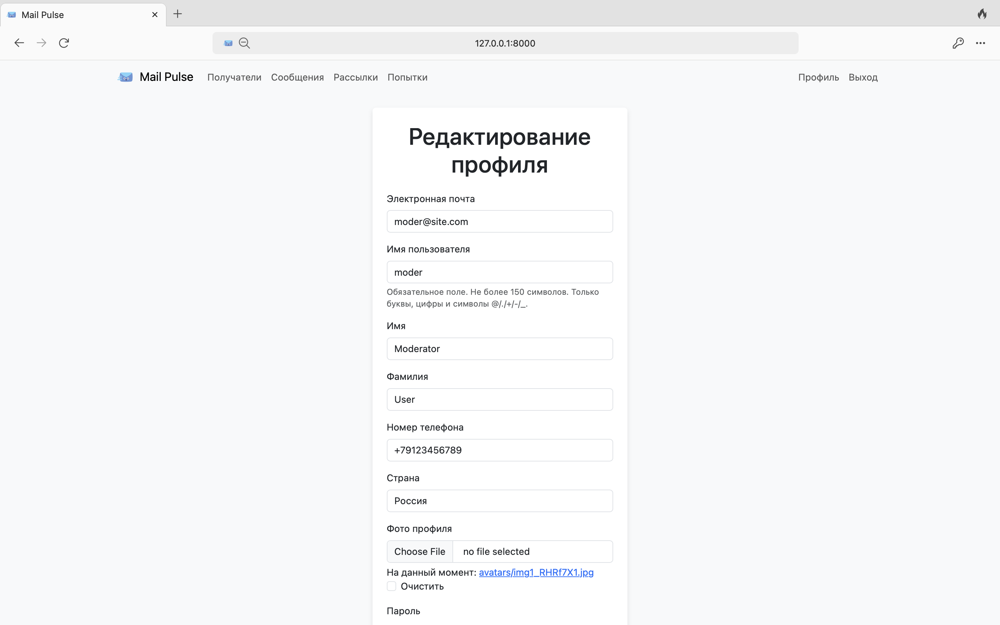

# Mail Pulse

[](https://www.python.org/downloads/release/python-3110/)
[](https://www.djangoproject.com/)
[](https://opensource.org/licenses/MIT)
[](https://github.com/yuldashov10/mail_pulse/actions)
[](https://github.com/yuldashov10/mail_pulse/actions)

---

## Описание проекта

**Mail Pulse** – это веб-приложение на основе Django для управления рассылками сообщений. Сервис должен позволять
пользователям создавать, редактировать, просматривать и удалять рассылки, а также отправлять сообщения клиентам вручную
или по расписанию. Проект включает функциональность аутентификации, ограничения доступа, кеширования и аналитики для
повышения эффективности и удобства использования.

> [Техническое задание](./TASKS.md)

---

## Стек технологий

- [x] **Python 3.11**
- [x] **Django 4.2**
- [x] **PostgreSQL**
- [x] **pytest**
- [x] **Poetry**
- [x] **Bootstrap**

---

## Как запустить проект локально

1. **Клонируйте репозиторий:**
   ```bash
   git clone https://github.com/yuldashov10/mail_pulse.git
   cd mail-pulse
   ```

2. **Создайте и активируйте виртуальное окружение:**
   ```bash
   python -m venv .venv
   source .venv/bin/activate       # Linux/MacOS
   call .venv\Scripts\activate     # Windows
   ```

3. **Установите зависимости:**
   ```bash
   pip install -r requirements.txt
   ```

4. **Настройте файл окружения:**

    - Скопируйте `.env.sample` в `.env` и заполните переменные.

5. **Примените миграции:**
   ```bash
   python manage.py migrate
   ```

6. **Создайте группу менеджеров:**
   ```bash
   python manage.py setup_managers_group
   ```

7. **Наполните базу тестовыми данными (Опционально):**
   ```bash
   python manage.py populate_db
   ```

8. **Запустите сервер:**
   ```bash
   python manage.py runserver
   ```

Сервис доступен по адресу: http://127.0.0.1:8000/

### Кастомные команды:

- `setup_managers_group` – создаёт группу `"Менеджеры"` для управления правами доступа.
- `populate_db` – заполняет базу тестовыми данными (пользователи, рассылки, получатели).
- `send_mailing` – запускает отправку запланированных рассылок.

   ```bash
   python manage.py setup_managers_group
   python manage.py populate_db
   python manage.py send_mailing <mailing_id>
   ```

---

## Запуск тестов

> Важно: Для корректной работы тестов установите
> `EMAIL_BACKEND = 'django.core.mail.backends.locmem.EmailBackend'` в `.env` или настройках.

```bash
python -m pytest tests/ --cov=users --cov=mailings --cov-report=html --cov-report=term-missing
```

> Результаты покрытия будут сохранены в `htmlcov/index.html.`

---

## Примеры страниц

- Главная страница:



- Страница регистрации:



- Страница авторизации:



- Главная страница с базовой статистикой:



- Список получателей:



- Список сообщений:



- Список рассылок:



- Список попыток рассылки:



- Профиль пользователя:



- Редактирование профиля:



---

## Автор

[Shoxrux Yuldashov](https://t.me/shyuldashov/)
